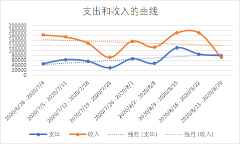
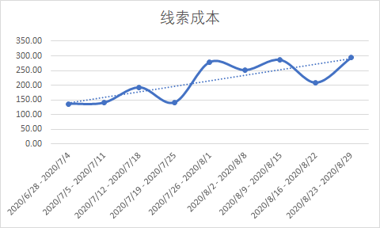
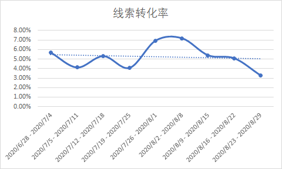
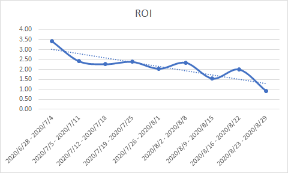
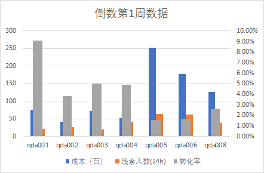
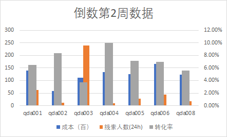

# 阶段一大作业：渠道优化分析  

1.请依据数据，在同一个图中做出支出和收入的曲线，并做出两者的趋势线，分析两者趋势（20分）  

2.通过支出和收入的曲线和趋势线，我们发现近期收入呈（B）趋势（5分），近期支出呈（A）趋势（5分）。说明近期的渠道毛利呈（B）趋势（5分），渠道盈利情况逐渐（E）（5分）；  

3.请同学们在excel中将以上指标求解完成，并分别做出线索成本、线索转化率、ROI的曲线与趋势线（20分）  

4.1 请筛选出各渠道近两周（数据表中的最后两周）的数据，计算每周的各渠道的成本、转化率、线索量，并用柱状图/条形图对比。（15分）  

| 周数      | 渠道名称 | 渠道成本 | 阅读量 | 线索人数(24h) | 报名人数 | 转化率 |
| --------- | -------- | -------- | ------ | ------------- | -------- | ------ |
| 倒数第1周 | qda001   | 7600     | 3223   | 22            | 2        | 9.09%  |
| 倒数第1周 | qda002   | 4200     | 3284   | 26            | 1        | 3.85%  |
| 倒数第1周 | qda003   | 7300     | 3200   | 20            | 1        | 5.00%  |
| 倒数第1周 | qda004   | 5200     | 2246   | 41            | 2        | 4.88%  |
| 倒数第1周 | qda005   | 25300    | 9322   | 63            | 1        | 1.59%  |
| 倒数第1周 | qda006   | 17800    | 15150  | 62            | 1        | 1.61%  |
| 倒数第1周 | qda008   | 12700    | 9397   | 39            | 1        | 2.56%  |
| 倒数第2周 | qda001   | 14000    | 14632  | 62            | 4        | 6.45%  |
| 倒数第2周 | qda002   | 5800     | 2903   | 12            | 1        | 8.33%  |
| 倒数第2周 | qda003   | 11200    | 10722  | 240           | 9        | 3.75%  |
| 倒数第2周 | qda004   | 13400    | 8482   | 10            | 1        | 10.00% |
| 倒数第2周 | qda005   | 12600    | 11275  | 28            | 2        | 7.14%  |
| 倒数第2周 | qda006   | 16700    | 11081  | 43            | 3        | 6.98%  |
| 倒数第2周 | qda008   | 12400    | 6869   | 18            | 1        | 5.56%  |

4.2 观察是渠道成本上升引发的问题？还是渠道转化率下降引发的问题？还是渠道线索量下降引发的问题？（如果是多个因素，可以说是多个因素的问题。）（15分）  

| 周数      | 渠道成本 | 成本（百） | 阅读量 | 线索人数(24h) | 报名人数 | 转化率 |
| --------- | -------- | ---------- | ------ | ------------- | -------- | ------ |
| 倒数第1周 | 67400    | 674        | 36425  | 234           | 8        | 3.42%  |
| 倒数第2周 | 98800    | 988        | 75361  | 452           | 22       | 4.87%  |

对比倒数第2周与第1周，渠道的总成本下降，阅读量下降，转化率也下降；从各个渠道的表现来看，qda003的线索量有明显的下降导致后续报名人数不足，qda005，qda006的成本有明显的上升但是转化率反而有所下降，建议冷冻该渠道或进行测实

5*（拔高题）.对于后续的渠道投放，请综合分析各渠道的投放质量，选取几个有代表性的字段，说明选取这个字段的原因，并按这些字段对渠道做综合打分。（5分）

6*（拔高题）.请将以上小题的分析结论做出一个结案报告。（5分）